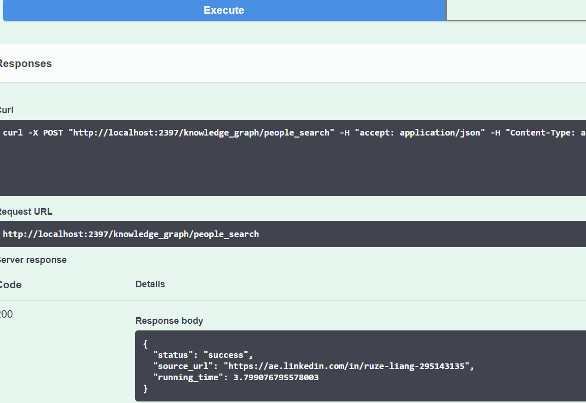
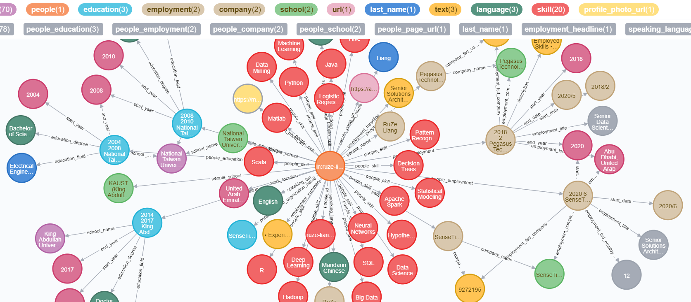

# Working People Knowledge Graph Search Engine

This is a knowledge graph of working people ready for search. The knowledge graph is built by 

* crawling data from open-source websites, and 
* using advanced NLP and knowledge extraction and alignment algorithms to transform the webpages to knowledge graph
* storing the knowledge in a Elasticsearch to allow the users to search the persons by names

To use it: 

### 1. pull the docker from the docker hub

```bash
docker pull ruzeliang/people_knowledge_graph:1.0.1
```

### 2. run the docker

```bash
docker run -it ^
-p 0.0.0.0:7469:7469 ^
-p 0.0.0.0:4387:4387 ^
-p 0.0.0.0:5644:5644 ^
-p 0.0.0.0:3941:3941 ^
-p 0.0.0.0:2397:2397 ^
ruzeliang/people_knowledge_graph:1.0.1 
```

the docker will start the service of the knowledge graph for search, wait for a few minutes, until you see the following


### 3. open the input interface of FLASK 

http://localhost:2397/

### 4. input the company name you want to search from the knowledge graph


### 5. click "Excute" to search



### 6. open the search result interface from 

http://localhost:5644/browser/

### 7. see the search results of the knowledge graph for the name "RuZe Liang"


